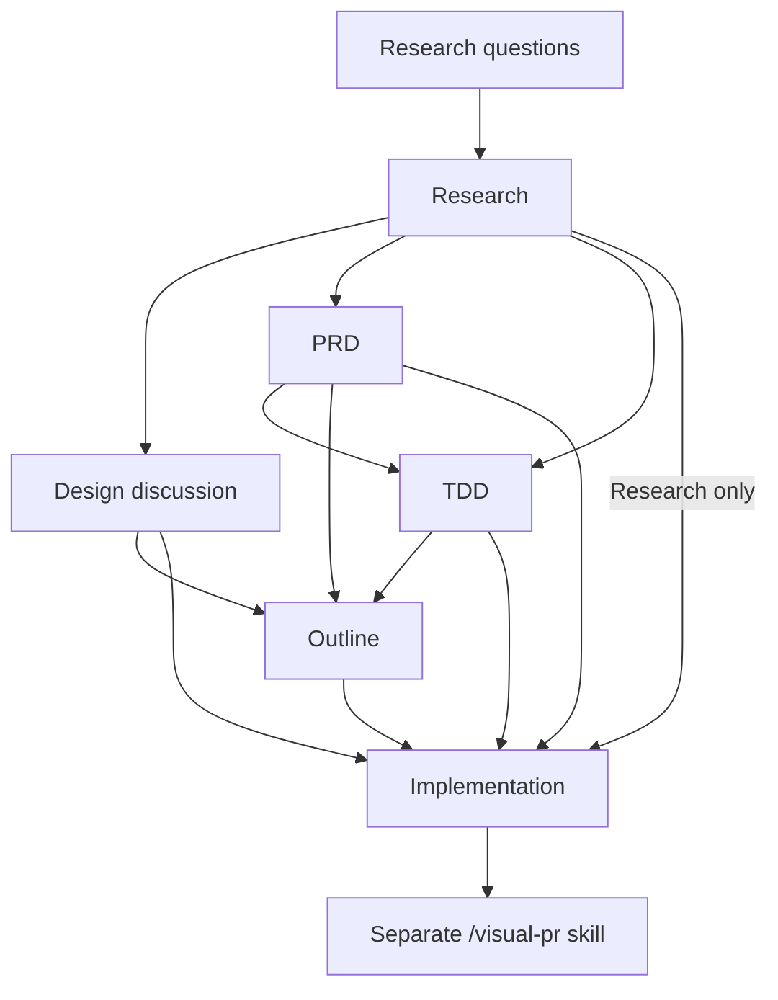

# Choose a Workflow

Research establishes what exists, design settles what should change, and implementation builds the agreed result. Use the shortest path that gives the user useful review points.

## Four Starting Flows

Each flow starts with research questions and research by default:



| Flow | After research | Typical next step | Other choices |
| --- | --- | --- | --- |
| Design discussion | Discuss product and technical choices together | Outline, then implementation | Implement directly |
| PRD | Define the product solution | TDD, then outline and implementation | Outline or implement directly |
| TDD | Define the technical approach | Outline, then implementation | Implement directly |
| Research only | Proceed to implementation | Implement from the research | Add design or an outline if useful |

- Design discussion combines product and technical choices in one document. It fits a change with a few clear options.
- PRD followed by TDD separates the user-facing result from the technical approach. It fits a larger feature with open product questions.
- TDD goes straight to technical choices. It fits fixes, cleanup, and refactoring where the desired behavior is already clear.
- Research only answers questions about the current system, then proceeds to implementation with design steps skipped.

The user can start at any step. After research or any design step, they can choose an outline or direct implementation. A PRD can lead directly to an outline or implementation when enough detail is already settled.

## Each Phase Has a Clear Job

| Phase | Result | Review point |
| --- | --- | --- |
| Research questions | Focused questions about current behavior, with exact source pointers | The user can refine the scope before research |
| Research | Findings from live code, tests, and available sources | The user can check the facts before design |
| Design discussion | Current state, desired state, options, and agreed choices | The user settles the design choices |
| PRD | Product problem, success measure, and user-facing solution | The user approves the product solution |
| TDD | How components interact, then the shape of the code and tests | The user approves system design, then program design |
| Outline | Ordered phases, each with a testable result, affected files, and checks | The user reviews the scope and phase order |
| Implementation | Code and tests based on the agreed documents | Checks and user testing confirm the result |

## Documents Carry Context Between Sessions

Use a separate context window for each phase by default. Save current decisions, user approvals, and unfinished questions in the document before handing off. Each next command includes the task directory and chosen flow, for example:

```text
/rpi research .agents/artifacts/task-retries; next: PRD then TDD
/rpi make a PRD .agents/artifacts/task-retries; flow: PRD then TDD
/rpi make an outline .agents/artifacts/task-retries
/rpi implement .agents/artifacts/task-retries
```

The user can also continue here or compact before running the next command. Feedback updates the document that owns the choice, either in the current session or through a new `/rpi` invocation:

```text
/rpi update the TDD .agents/artifacts/task-retries to use the existing worker queue
```
